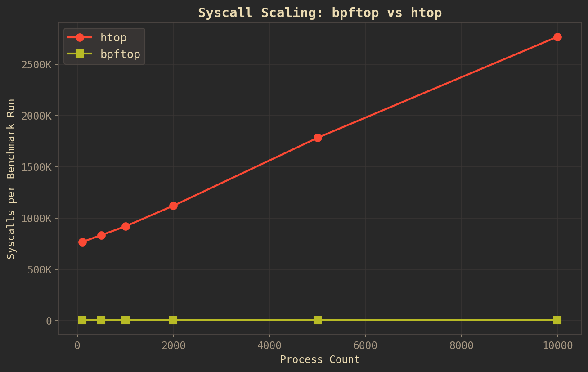
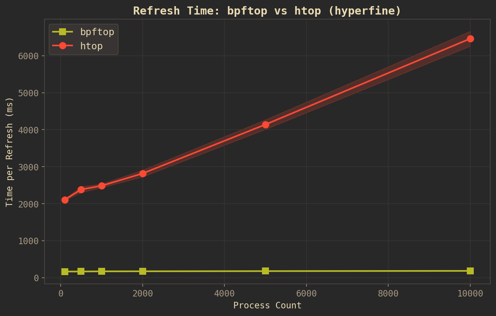
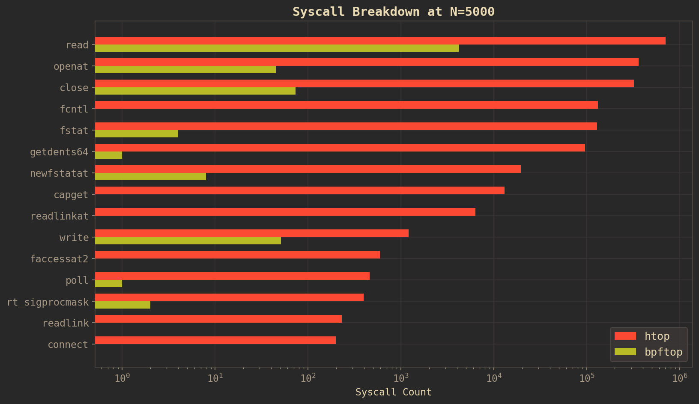

# What is this

An eBPF-powered interactive process monitor. Think `top` but using BPF iterators and perf events to get per-process stats with minimal overhead. TUI built with ratatui.

# Disclaimer

I worked with claude when writing this. Claude has touched many parts of this codebase.

# How to install

There's a nix flake. Two package outputs: dynamically linked (default) and a fully static musl binary.

## NixOS

Add the flake input and enable the module. This installs bpftop with Linux capabilities (`cap_bpf`, `cap_perfmon`, `cap_sys_resource`) so it runs without sudo.

```nix
# flake.nix
{
  inputs.bpftop.url = "github:DieracDelta/bpftop";

  outputs = { self, nixpkgs, bpftop, ... }: {
    nixosConfigurations.myhost = nixpkgs.lib.nixosSystem {
      modules = [
        bpftop.nixosModules.default
        {
          programs.bpftop.enable = true;
        }
      ];
    };
  };
}
```

Then `bpftop` is available at `/run/wrappers/bin/bpftop` and works without sudo.

## Non-NixOS with Nix

```bash
# dynamic binary
nix build github:DieracDelta/bpftop
sudo ./result/bin/bpftop

# static binary (no runtime deps, copy it wherever)
nix build github:DieracDelta/bpftop#static
sudo ./result/bin/bpftop
```

Without the NixOS module you need sudo (or manually `setcap cap_bpf,cap_perfmon,cap_sys_resource=eip` on the binary).

## Non-Nix Linux

Grab the static binary from the releases or build it yourself. You need nightly rust, `rust-src`, and `bpf-linker`.

```bash
# build the eBPF object first (use arch-aarch64 on arm64)
cd bpftop-ebpf
cargo build --target bpfel-unknown-none -Z build-std=core --release --features arch-x86_64
cd ..

# then the userspace binary
cargo build --release --bin bpftop

# run it
sudo ./target/release/bpftop
```

To avoid sudo, set capabilities on the binary:

```bash
sudo setcap cap_bpf,cap_perfmon,cap_sys_resource=eip ./target/release/bpftop
./bpftop
```

# Usage

```bash
bpftop                     # default 1s refresh
bpftop -d 500              # 500ms refresh rate
bpftop -t                  # start in tree view
bpftop -u jrestivo         # filter by user
```

# Development

```bash
nix develop
# bpf-linker is installed via cargo install bpf-linker in the devshell
cd bpftop-ebpf && cargo build --target bpfel-unknown-none -Z build-std=core --release --features arch-x86_64 && cd ..
cargo build --release --bin bpftop
sudo ./target/release/bpftop
```

# Build details

The build is two-phase. Phase 1 compiles the eBPF program (`bpftop-ebpf`) for the `bpfel-unknown-none` target using `-Z build-std=core`. Phase 2 compiles the userspace binary which embeds the eBPF object at compile time via `include_bytes_aligned!`. The eBPF crate is excluded from the cargo workspace because it targets a completely different architecture.

The nix package builds bpf-linker v0.10.1 from source against LLVM 22 to match the nightly rust toolchain's LLVM version. nixpkgs ships bpf-linker 0.9.15 with LLVM 21 which can't read object files produced by the newer LLVM.

# Limitations

Kernel struct field offsets (e.g. `task_struct`, `mm_struct`) are hardcoded per architecture at compile time. This means the eBPF program must be built with the correct `--features arch-x86_64` or `--features arch-aarch64` flag, and may break across kernel versions if struct layouts change.

Ideally we'd use CO-RE (Compile Once, Run Everywhere) to resolve offsets at load time from the target kernel's BTF. Aya's loader fully supports CO-RE relocations, but aya-ebpf (the BPF-side Rust SDK) can't emit them because rustc doesn't expose LLVM's `__builtin_preserve_access_index` intrinsic. This is tracked at https://github.com/aya-rs/aya/issues/349.

# Acknowledgements

htop was the inspiration for this project. It's too resource heavy! bpftop is much faster — see the benchmarks below

psc was also an inspiration for this project. I didn't realize bpf was this far along until I saw that project.

# Performance

bpftop uses a BPF task iterator to walk the kernel's task list in a single pass, plus 4 constant `/proc` reads for system-wide stats (`/proc/stat`, `/proc/meminfo`, `/proc/loadavg`, `/proc/uptime`). htop opens and reads ~4 files per process per refresh (`/proc/PID/stat`, `status`, `cmdline`, `cgroup`), so its syscall count grows linearly with process count.

**Syscall scaling** — At each process count (100–10,000), dummy `sleep` processes are spawned and both tools are run under `strace -f -c` to count total syscalls. htop scales linearly; bpftop stays flat.



**Collection time** — Each tool is benchmarked with `hyperfine` at each scale point. bpftop runs `bench --iterations 1 --warmup 0` (one BPF iterator walk + 4 `/proc` reads). htop runs `htop -d 1 -n 5` under `script` for a pseudo-tty. Shaded bands show stddev.



**Syscall breakdown at N=5000** — Per-syscall counts from `strace -f -c` showing htop dominated by `read`/`openat`/`close` (per-PID `/proc` scraping) while bpftop's counts are near zero on the log scale.



## Reproducing

```bash
# Build the bench binary
cargo build --release --bin bench

# Enter the devshell (provides hyperfine, strace, htop, matplotlib)
nix develop

# Run benchmarks (needs root for BPF)
sudo bash bench/run.sh

# Generate graphs
python3 bench/plot.py
```

See `bench/` for the full methodology. Timing uses [hyperfine](https://github.com/sharkdp/hyperfine) for statistically rigorous measurements. Syscall counts use `strace -c`.
